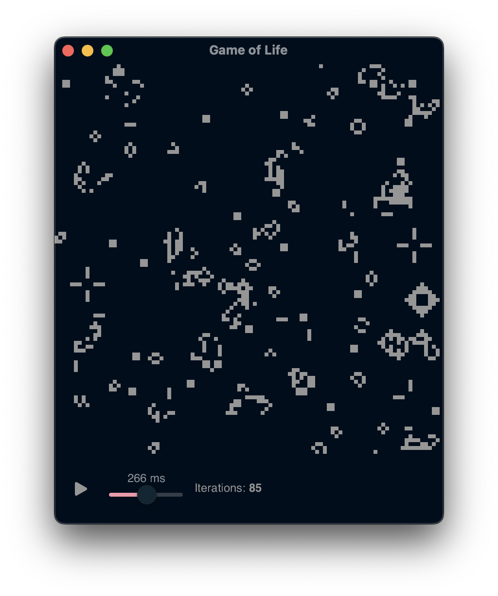

# Game of Life



## Features

- you can interfere with the cells (create or kill existing)
- control the iteration speed
- play/pause

To edit cells just click on the board, the game will be automatically paused and you will be able to draw new or remove existing cells.

> [!NOTE]
> At the moment the app only worls on macOS due to `gnt`,
> in the future I will make it optional dep.

## Requirements

- Recent C++ compiler
- gtk4 (GUI lib)
- meson (build automation)
- [ggb](https://github.com/SebastianPilarz/gtk-grid-board) (my grid board lib)
- [gnt](https://github.com/SebastianPilarz/gtk-native-tweaks) (my gtk tweaks lib)

## Build

```bash
meson setup build
cd build
meson compile
./game-of-life
```
